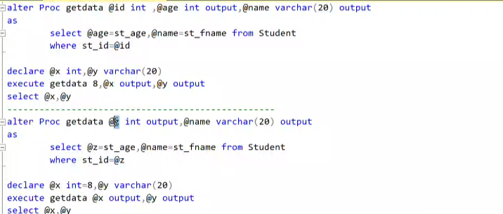

# Stored Procedures and Triggers

## Stored Procedures

> [!tip] views vs stored procedures
>
> - views short on select statements
> - views has nothing to do with performance

> [!tip] steps to execute queries
>
> - parse syntax: check for syntax errors
>   optimize metadata: check for table and column existence
> - query tree: from, where, group by, having, order by,slect
> - execution plan: how to execute the query
> - execute the query
>   > [!warning] doing the above steps for each query is time consuming
>   >
>   > - stored procedures are used to save time and effort
>   > - only on first execution, the steps are done
>   > - then save the query tree so that the next time the query is executed, the steps are skipped

> [!done] stored procedures
>
> - more secure as the metadata is not exposed neither the query itself
> - can write all kinds of queries in stored procedures unlike views
> - hide business logic
> - can run conditional statements to avoid errors
> - can use views and functions in stored procedures
> - custom constraints can be added
> - dynamic queries can be written(`execute` command) unlike views
> - prevent sql injection

> [!example] stored procedures vs views vs functions
>
> - although stored procedures are more secure, we still use views and functions
> - we can use views and functions in stored procedures
> - views can be joined with tables and other views

> [!bug] we can run conditional statements in stored procedures to avoid errors `begin try` and `begin catch`
>
> - and thats good for security as we hide the metadata coming from the database

> [!tip] summary
> 

```sql
use ITI;

select * from student;--estimated execution plan

--instead of creating query tree and execution plan every time, we can use stored procedures

create proc  getStudents
as
    select * from student;

-- calling the stored procedure
getStudents;
exec getStudents;
execute getStudents; -- in special cases we have to use execute

-- parameters
create proc getStudentsByAddress @address varchar(50)
as
    select * from student where address = @address;

-- calling the stored procedure with parameters
getStudentsByAddress 'Cairo';
getStudentsByAddress 'Alex';

-- it is object in the database
-- we can change its schema, drop it
alter schema HR transfer getStudentsByAddress;

HR.getStudentsByAddress 'Cairo';

-- we can declare it with schema
create proc HR.getStudentsByAddress @address varchar(50)
as
    select * from student where address = @address;


--drop the stored procedure
drop proc getStudentsByAddress;

-- alter the stored procedure
alter proc getStudentsByAddress @address varchar(50)
as
    select * from student where address = @address
    order by name;

-- with encryption
create proc getStudentsByAddress @address varchar(50)
with encryption
as
    select * from student where address = @address

sp_helptext 'getStudentsByAddress'


-- can't delete data that has a foreign key ( child )
delete from topic where top_id = 1; -- error

-- we can use stored procedures to handle this
create proc deleteTopic @top_id int
as
    if not exists (select * from course where top_id = @top_id)
       delete from topic where top_id = @top_id;
    else
         select 'table has relationship ';

deleteTopic 1;-- table has relationship
deleteTopic 2;-- 1 row affected

```

```sql
-- parameters    return values
create proc sum @x int, @y int
as
    select @x + @y;

-- calling the stored procedure
sum 10, 20; -- passing parameters by position (data type must match) order matters (@x = 10, @y = 20)
sum @y = 7, @x = 3; -- passing parameters by name (data type must match) order doesn't matter

sum 10; -- error
sum; -- error

-- we can use default values
create proc sum @x int , @y int = 0
create proc sum @x int = 0, @y int = 0
as
    select @x + @y;

-- calling the stored procedure
sum 10; -- 10
sum 10, 20; -- 30
sum; -- 0

```

```sql
alter proc getStudentsByAddress @address varchar(50)
with encryption
as
    select * from student where address = @address

-- calling the stored procedure
getStudentsByAddress 'Cairo'; --return table

-- how to store the result of the stored procedure in a variable
declare @result table (id int, name varchar(50), address varchar(50));
insert into @result
    -- getStudentsByAddress 'Cairo';-- error
execute getStudentsByAddress 'Cairo';-- we have to use execute in this case
select * from @result;
select count(*) from @result;

insert into grades(st_id,sname)
 execute getStudentsByAddress 'Cairo';
 --this will insert the result of the stored procedure into the table grades

--scalar
create proc getData @id int
as
    declare @age int
    select @age = age from student where id = @id;
    return @age; -- return is optional unlike functions

-- stored procedure with return value
declare @age int;
execute @age = getData 1;
select @age;
--this will return the age of the student with id = 1

-- this return int only unlike fuctions(return any data type)
-- we can return only one value unlike functions(return multiple values, table)
-- return value in stored procedure used to return status of the stored procedure (0 for success, 1 for failure, 2 for warning, 3 primary key is not found)

-- call by reference
create proc getData @id int, @age int output
as
    select @age = age from student where id = @id;

declare @x int;
execute getData 1, @x output;
select @x;
--@x and @age are  references to the same memory location
--any change in @age will be reflected in @x

-- we have to write output in both the stored procedure and the execute command

```

---



> [!tip] `where` is excuted before `select` so we used the variable before it is changed

```sql
-- dynamic  stored procedure
create proc getValues @col varchar(50), @table varchar(50)
as
    -- select @col from @table;-- Error
    -- we can't use variables in the from clause
    exec('select ' + @col + ' from ' + @table);-- space is important

getValues 'name', 'student';
getValues 'age', 'student';


```

---

> [!tip] types of stored procedures
>
> - user defined stored procedures (we created)
> - system stored procedures: `sp_helptext`, `sp_bindefault`, `sp_helpindex`, `sp_helpconstraint`
> - inside `programmability` folder in the database `stored procedures` folder => `system stored procedures`
> - Trigger: special type of stored procedure that is automatically executed when an event occurs in the database server (can't take parameters)

> [!tip] Triggers
>
> - special type of stored procedure
> - can't call
> - can't take parameters
> - automatic firing
> - implicit code

> [!tip] any creadted object is defined in one of these levels (DB, schema, object[ table ])
>
> - trigger can be defined in any of these levels

> [!bug] `instead of` vs `after`
>
> - `instead of`: trigger will be executed instead of the operation
> - `after`: trigger will be executed after the operation

```sql
insert into student values(1, 'Ahmed', 20, 'Cairo');
-- 1 row affected
-- no result set after the insert statement

-- we can use triggers to do something after the insert statement
create trigger tr_student_insert
on student
for insert
as
    select 'student inserted';
-- this trigger will be executed after the insert statement
-- this trigger is defined in the table level
insert into student values(2, 'Ali', 25, 'Alex');-- student inserted

--create  trigger on update
create trigger tr_student_update
on student
after update -- same as for update
as
    select getdate(),suser_name(),db_name(),host_name();-- getdate() returns the current date and time
update student set name = 'Mohamed' where id = 1;-- date, user, database, host name will be returned
-- this trigger will be executed after the update statement

--cteate trigger to prevent delete
create trigger tr_student_delete
on student
instead of delete
as
    select 'delete is not allowed';
delete from student where id = 1;-- delete is not allowed


-- we can prevent multiple statements in the trigger
-- make this table Read-Only
create trigger tr_student_insert
on student
instead of insert, update, delete
as
    select 'not allowed'+ ' ' + suser_name();

update student set name = 'Mohamed' where id = 1;-- not allowed user_name


-- to deal with update , insert, delete we have to specify the table

-- if we specified database => drop, alter

-- instead of vs after
-- instead of: we can prevent the operation
-- after: we can do something after the operation
-- no before in triggers
-- use stored procedures for writing queries before as there is no before in triggers


--disable trigger
alter table student disable trigger tr_student_insert;

--enable trigger
alter table student enable trigger tr_student_insert;


create trigger tr_course_update
on course
after update
as
    select 'course updated';

    update course set name = 'Math' where id = 1;-- course updated

    -- the trigger will be executed after the update statement whether it affected rows or not
    -- the only way the trigger will not be executed is if the update syntax is wrong

-- trigger schema : is the schema of the table
-- we can't create trigger in a different schema

-- and to deal with the trigger again (alter) we have to use the same schema
create trigger tr_student_update
on HR.student
after update
as
    select 'student updated';

alter trigger HR.tr_student_update
on HR.student
after update
as
    select 'student updated';

-- schema of the table and the trigger are always matched


-- we can use update as function in the trigger
create trigger tr_student_update
on student
after update--query
as
    if update(name) --function: if the name column is updated
        select 'name updated';
    else
        select 'name not updated';

update student set name = 'Mohamed' where id = 1;-- name updated
update student set age = 30 where id = 1;-- name not updated

```

---

###

> [!tip] any database has 2 tables `inserted` and `deleted`
>
> - `inserted`: contains the new values of the rows that are inserted or updated
> - `deleted`: contains the old values of the rows that are updated or deleted
>   > [!danger] these tables are created and destroyed in runtime and can't be used ==outside== the ==trigger==

```sql
select * from inserted;--error invalid object name
select * from deleted;--error invalid object name

-- we can use these tables in the trigger
create trigger tr_inserted_deleted
on course
after update
as
    select * from inserted;
    select * from deleted;

update course set crs_name = 'Math' where crs_id = 1;
-- this will return the old and new values of the updated row
-- with every fire of the trigger, 2 tables are created and destroyed in runtime

-- tables are similar to the table that the trigger is defined on

-- these will be created whether the query is executed or not

-- we know what are the rows they tried to delete
create trigger tr_course_delete
on course
instead of delete
as
    select 'not allowed' + (select crs_name from deleted);

delete from course where crs_id = 1;-- not allowed Math

-- prevent insert on student on friday
-- can be instead of or after
create trigger tr_student_insert
on student
instead of insert
as
    if format(getdate(), 'dddd') = 'Friday'
        select 'not allowed';
    else
        insert into student select * from inserted;
-- inserted has the values of the rows that are tried to be inserted

-- after insert
create trigger tr_student_insert
on student
after insert
as
    if format(getdate(), 'dddd') = 'Friday'
        begin
            delete from student where id in (select id from inserted);
            select 'not allowed';
        end


-- prevent update on topic_id and when trying to update store information about user and data in another table

create table update_log
(
    user_name varchar(50),
    update_date datetime,
    old_id int,
    new_id int,
    actionnote varchar(50)
);

create trigger tr_topic_update
on topic
instead of update
as
    if update(top_id)
        begin
        declare @old_id int, @new_id int;
        select @old_id = top_id from deleted; --deleted the old value
        select @new_id = top_id from inserted; --inserted the new value we want to update
            insert into update_log
            svalues(suser_name(), getdate(), @old_id, @new_id, 'update topic_id');
        end
-- update is replaced by insert
update topic set top_id = 2 where top_id = 1;
select * from update_log;

-- can be used for security
-- replace query with another query
-- can prevent the query from being executed
```

---

> [warning] Run Time Triggers
>
> - `output`: used to get info about the query that it is used in

```sql
-- run time triggers
-- output
-- to get info about this specific query (not all update queries)
update Instructor
set salary = 10000
output getdate() --- date and time of the update
, suser_name() --- user name that executed the update
, deleted.salary --- old salary
, inserted.salary --- new salary
, 'update salary' --- action note
into update_log -- we can store the result of the output in a table
where id = 1;

update Instructor
set salary = 20000
where id = 1;
-- this won't be logged in the update_log table as output is not used


-- get db name that is being updated
update Instructor
set salary = 30000
output db_name() --- database name
, suser_name() --- user name that executed the update
where id = 1;
```
---
>[!danger] Common Type Expression (CTE)
> - Common Type Expression (CTE)  (🔌)
> - will update the file later
> - you can get the updated file from the [github](https://github.com/Muhammad-Ashraf9/PD)

```sql
--self join
select *
from Student X, Student Y
on  X.sid  = Y.fid;
-- (parent: who has the primary key) (child: who has the foreign key)


--Common Type Expression (CTE)
```
---
### XML
>[!tip] XML
>
> - Extensible Markup Language
> - text based format way to store and transport data
> - lighter than databased used to store small data like configuration files
> - operating system independent
> - application independent
> - hard to write same queries in different databases engines(oracle, sql server, mysql)
> - so we can use to XML to store the data and then use it in different databases

>[!warning] XML => data table and data table => XML
> - `open XML` to convert XML to data table
> - `for XML`  `[auto, raw, explicit, path]` to convert data table to XML
```sql
select * from student for xml raw;
-- this will return the data in XML format
--<row id="1" name="Ahmed" age="20" address="Cairo" />
--<row id="2" name="Ali" age="25" address="Alex" />

select * from student for xml raw('student');
--<student id="1" name="Ahmed" age="20" address="Cairo" />
--<student id="2" name="Ali" age="25" address="Alex" />

select * from student for xml raw('student'), elements;
--<student>
--  <id>1</id>
--  <name>Ahmed</name>
--  <age>20</age>
--  <address>Cairo</address>
--</student>

select * from student for xml raw('student'), elements, root('ITI');
--<ITI>
--  <student>
--    <id>1</id>
--    <name>Ahmed</name>
--    <age>20</age>
--    <address>Cairo</address>
--  </student>
-- </ITI>

```

>[!danger] check file xml `xml.sql`

>[!warning] `for xml raw`
> -  can't understand joins (instead of listing all coruses under on topic it will repeat the topic for each course)
> - it is either all elements or all attributes
> -  can't make mix of elements and attributes

>[!danger] `for xml auto`
> - solved the problem of `for xml raw` by listing all courses under one topic (Joins)
> - can understan Join 
> - but still have the problem of either all elements or all attributes 
> - can't make mix of elements and attributes

>[!danger] `for xml path`
> - use alias name to make mix of elements and attributes
> - `@sid` to make attribute
> - `st_fname "studentName/@firstName"` to make mix of elements and attributes
> - `st_lname "studentName/lname"` 
> - `address "address"`


---
>[!tip] xml => data table
>
> - `openXML` to convert XML to data table
> - this will create runtime table to save it we use `insert` or `select into`

```sql
--1)create proc processtree
declare @docs xml =
				'<Students>
				 <Student StudentID="1">
					<StudentName>
						<First>AHMED</First>
						<Second>ALI</Second>
					</StudentName>
					<Address>CAIRO</Address>
				</Student>
				<Student StudentID="2">
					<StudentName>
						<First>OMAR</First>
						<Second>SAAD</Second>
					</StudentName>
					<Address>ALEX</Address>
				</Student>
				</Students>'

--2)declare document handle
declare @hdocs int

--3)create memory tree
Exec sp_xml_preparedocument @hdocs output, @docs

--4)process document 'read tree from memory'
--OPENXML Creates Result set from XML Document

SELECT * 
FROM OPENXML (@hdocs, '//Student')  --levels  XPATH Code
WITH (StudentID int '@StudentID',
	  Address varchar(10) 'Address', 
	  StudentFirst varchar(10) 'StudentName/First',
	  StudentSECOND varchar(10) 'StudentName/Second'
	  )
--5)remove memory tree
Exec sp_xml_removedocument @hdocs
```


