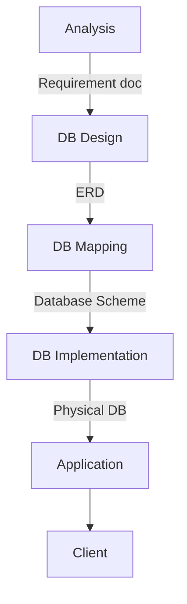

## Database (Fundamentals)
**Course Content**

* [[#Lecture 1]]
	* DB Design
	* ERD
	* DB Concepts
	* File Based Systems 
	* DB Systems
	* DB Life Cycle
* [[#Lecture 2]] 
	* DB Mapping
	* DB Scheme
	* Create Db
	* Tools
	* RDBMS
	* SQL Queries
* [[#Lecture 3]]
	* Joins
	* Like
	* Normalization
* [[#Lecture 4]]
	* Aggregate Functions
	* Grouping
	* Subqueries
	* Union
	* Data Types
	* EERD 'Enhanced ERD'
* [[#Lecture 5]]
	* Db Engine
	* DB Service
	* Ranking Function
	* Window Function
	* Security


# Lecture 1

## Key Concepts

> [!info] Definitions
> - 📊 **Data:** Collection of facts and statistics for reference or analysis
> - ℹ️ **Information:** Processed and organized data that is useful and meaningful
> - 🗄️ **Database:** Collection of related data organized into tables
> - 💻 **Database System:** System containing databases (Software + Database)
> - 🛠️ **DBMS:** Database Management System, software for creating and managing databases (e.g., SQL Server)

## Database Life Cycle



1. **Analysis** (by System Analyst) → Requirement doc
2. **DB Design** (by Database designer) → ERD
3. **DB Mapping** → Database Scheme
4. **DB Implementation** using RDBMS → Physical DB
5. **Application** (GUI Interface)
6. **Client** (End-user)

## File System

> [!note] File Based System
> A method of storing and organizing data using files

### Types:
1. **Delimited File:** Fields separated by a delimiter (e.g., CSV)
2. **Fixed Width File:** Each field has a fixed width (e.g., TXT)

## Database Evolution

1. 📁 File Based System
2. 💾 DBMS (e.g., IBM System/38)
3. 🗃️ RDBMS (e.g., MSSQL Server, MySQL, Oracle, PostgreSQL)
4. 📊 Multidimensional DB (e.g., IBM CONGOS, ORACLE OLAP)
5. 🔄 NoSQL DB (e.g., Redis, MongoDB)
6. 🕸️ Graph DB
7. 🆕 NewSQL DB

## File System vs Database System

| Feature | File System | Database System |
|---------|-------------|-----------------|
| Data Structure | Unstructured | Structured |
| Data Access | Direct | Indirect |
| Data Integrity | Low | High |
| Data Security | Low | High |
| Scalability | Limited | Scalable |
| Data Relationships | Limited | Complex |
| Data Manipulation | Simple | Complex |
| Querying | Inefficient | Efficient |
| Data Redundancy | High | Low |
| Data Consistency | Low | High |
| Transaction Support | No | Yes |
| User Access Control | Limited | Comprehensive |
| Data Backup and Recovery | Manual | Automated |

## SQL (Structured Query Language)

- **SQL** is a `Declarative` Programming Language used for Storing, Manipulating and Retrieving Data in a ` Relational Database `  

> [!tip] SQL Command Categories
> 1. **DDL** (Data Definition Language): CREATE, ALTER, DROP, RENAME, TRUNCATE, COMMENT
> 2. **DQL** (Data Query Language): SELECT, AGGREGATE FUNCTIONS
> 3. **DML** (Data Manipulation Language): INSERT, UPDATE, DELETE, MERGE, CALL
> 4. **TCL** (Transaction Query Language): COMMIT, ROLLBACK, SAVEPOINT, SET TRANSACTION
> 5. **DCL** (Data Control Language): GRANT, REVOKE

## Database Files

- 📄 **.mdf File:** Master Database File (stores actual database)
- 📜 **.log File:** Log Database File (contains database logs)

## Data Models

1. 🧠 **Logical Model (Meta Data):** Provides concepts (e.g., ERD)
2. 💽 **Physical Model (Actual Stored Data):** Describes data storage and access

## Three-Level/Scheme Architecture


1. 👤 **External Level:** User's view of the database
2. 🏗️ **Conceptual Level:** Logical structure of the database
3. 💾 **Internal/Physical Level:** Physical storage of data
4. 💿 **Database (Disk/Storage)**

> [!note] Architecture Types
> - **2-tier architecture:** Client-server architecture
> - **3-tier architecture:** Web-based application

## Entity-Relationship Diagram (ERD)

- **ERD** Acts as an intermediate between the `Business Requirement Documentation` and the Actual `Database` 
### Entities
- 💪 **Strong Entity:** Has a primary key
- 🔗 **Weak Entity:** Depends on a strong entity, has a partial key

### Attributes
- 🔹 **Simple Attribute:** Can't be divided
-  🔶 **Multi-valued Attribute:** Contains a list of values (double ellipse)
- 🔸 **Composite Attribute:** Can be split into components
- 🔻 **Derived Attribute:** Exists only in runtime (dashed ellipse)
- 🔷 **Complex Attribute:** Composite + Multi-valued

### Relationships
Links between entities

> [!info] Relationship Properties
> 1. **Degree:**
>    - Unary/Recursive/Self
>    - Binary
>    - Ternary
> 2. **Cardinality:**
>    - One-One
>    - One-Many
>    - Many-Many
> 3. **Participation:**
>    - Total `(Must Have)`
>    - Partial `(Can Have)` --> `Nullable`

> [!warning] Notes
> - Relationships may have attributes
> - Two entities can have multiple relationships with different meanings
> - Weak entities always have partial participation
> - Partial participation doesn't always indicate a weak entity

>[!error] Task Draw the ERD of This Doc
>**Problem 2**
>
>Prepare an E-R diagram for a real estate firm that lists properties for sale. The following describes this organization:u6  m
>
> - The firm has a number of sales offices in several states. Attributes of sales office include Office_Number and Location.
>
> - Each sales office is assigned zero or more employees. Attributes of employee include Employee_ID  and Employee_Name. An employee must be assigned to only one sales office.
>
> - For each sales office, there is always one employee assigned to manage that office and manager can’t manage many sales office at the same time.
>
> - The firm lists property for sale. Attributes of property include Property_ID and Location. Components of Location include Address, City, State, and Zip_Code.
>
> - Each property must be listed with one (and only one) of the sales offices. A sales office may have any number of properties listed, or may have no proper­ties listed.
>
> - Each property may have zero or more owners. Attributes of owners are Owner_ID and Owner_Name. An owner own one or more properties. The system stores the percent owned by each owner in each property.


# Lecture 2

## Database Mapping

> [!info] Definition
> **Database Mapping** is a set of rules for converting conceptual design (ERD) to logical design (DB Scheme).

### Mapping Rules:

- 📊 **Entity** becomes a **Table** (e.g., "Student")
- 🏷️ **Attribute** becomes a **Column** (e.g., "Name")
  - Row == record --> Meaning an instance of that entity with these attributes
  - Column crossed with Row is a cell (e.g., "Mohamed")
- 🔗 **Relationship** becomes **Foreign Key Constraints**

> [!note] Important Notes
> - Foreign key exists on the **M** relation
> - Tables with foreign keys are called **child tables**
> - Tables with primary keys are called **parent tables**
> - You cannot delete the primary key of a parent that exists on a child table
> - You can't delete the parent table without deleting all the children related to it
> - Arrow of relationship points to the primary key in ERD 
> - Drag the primary key to the foreign key in `SQL SERVER` Physical ERD

## ERD To DB Scheme Mapping (Best Practices)

1. **Mapping of Regular Entity Types** → Regular table
   - Simple attribute → Regular column
   - Composite attribute → Regular column(s)
   - Multivalued attribute → New table + Composite PK of [parent + column]
   - Complex attribute → New table + Composite PK of [parent + columns]
   - *No mapping for derived attribute*

2. **Mapping of Weak Entity Types** → Regular table with Composite PK [weak entity partial key + regular entity pk]

3. **Mapping of Binary 1:1 Relation Types** → FK in either table

4. **Mapping of Binary 1: N Relationship Types** → FK in the `many` table

5. **Mapping of Binary M:N Relationship Types** → New table + Composite PK [pk1+pk2+ relation attr]

6. **Mapping of N-ary Relationship Types** → New table + Composite PK [find your unique combination]

7. **Mapping of Unary/Self Relationship** → Create new FK to the PK of the same table

## Key Types in Attributes

> [!tip] Key Types
> - 🔑 **Candidate Key:** One or more attributes that can be elected as a primary key
> - 🔐 **Primary Key:** [Unique & Not Null] attribute
> - 🆔 **Unique Key:** Different key that isn't replicated in the table
> - 🔗 **Foreign Key:** Set of attributes referring to the primary key of another table
> - 🔢 **Composite Primary Key:** Combining two or more attributes to form a primary key
> - 🔓 **Partial Key:** Primary key for a weak entity
> - 🔝 **Super Key**
> - 🔽 **Sub Key**

## ANSI SQL Types


## Database Physical Design

> [!info] Definition
> **Physical Design** is converting logical design (DB Scheme) into the actual database using SQL.

### SQL Categories

> [!tldr]+ SQL Categories 
>
> - 🏗️ **DDL** (Data Definition Language): Meta Data & Structure
>   - CREATE, ALTER, DROP, RENAME, TRUNCATE, SELECT INTO
> - 🔄 **DML** (Data Manipulation Language):
>   - SELECT, INSERT, UPDATE, DELETE, MERGE, CALL 
> - 🔒 **DCL** (Data Control Language):
>   - GRANT, REVOKE, DENY
> - 🔍 **DQL** (Data Query Language): 
>   - SELECT + JOIN, GROUPING, SUBQUERIES, UNION, AGG FUNC
> - 💼 **TCL** (Transaction Query Language):
>   - BEGIN TRANSACTION, COMMIT, ROLLBACK, SAVEPOINT 

## Database Schema

> [!info] Definition
> A **database schema** is a **blueprint** that describes how data is organized within a relational database. It defines the **structure** of the database, including tables, fields, data types, and relationships.

## Database Constraints

> [!info] Definition
> **Database constraints** are **rules** or **restrictions** applied to the data in a database to ensure **data integrity**, **consistency, and adherence** to business rules.

- Constraints can be **column level** or **table level**
- You can't delete a parent record that has a child record

> [!example] Common Constraints
> - **NOT NULL**: Ensures that a column cannot have a NULL value
> - **UNIQUE**: Ensures that all values in a column are different
> - **PRIMARY KEY**: A combination of NOT NULL and UNIQUE
> - **FOREIGN KEY**: Prevents actions that would destroy links between tables
> - **CHECK**: Ensures that the values in a column satisfy a specific condition
> - **DEFAULT**: Sets a default value for a column if no value is specified

## Basic SQL Queries

```sql
-- DDL Examples
CREATE DATABASE MyfirstDB
DROP DATABASE MyfirstDB
USE MyfirstDB

CREATE TABLE employee (
    eid INT PRIMARY KEY,
    ename VARCHAR(50) NOT NULL,
    eadd VARCHAR(20) DEFAULT 'cairo',
    hiredate DATE DEFAULT GETDATE(),
    salary INT DEFAULT 5000,
    age INT,
    Dnum INT  
)

ALTER TABLE employee ADD overtime INT
ALTER TABLE employee ALTER COLUMN overtime BIGINT
ALTER TABLE employee DROP COLUMN overtime

-- DML Examples
INSERT INTO employee VALUES(1,'ahmed','alex','1/1/2000',8000,21,NULL)

UPDATE employee SET eadd='mansoura'
UPDATE employee SET eadd='aswan' WHERE eid=1
UPDATE employee SET salary+=100

DELETE FROM employee WHERE eid=1

-- DQL Examples
USE ITI

SELECT * FROM Student
SELECT * FROM Student WHERE st_address='alex'
SELECT st_id, st_fname FROM Student WHERE st_age>25

SELECT DISTINCT st_fname FROM Student

SELECT st_fname + ' ' + st_lname AS fullname FROM Student
SELECT st_fname + ' ' + st_lname AS [full name] FROM Student

SELECT * FROM Student ORDER BY st_age
SELECT * FROM Student ORDER BY st_age DESC

SELECT * FROM Student WHERE st_address IN ('alex', 'cairo', 'mansoura')
SELECT * FROM Student WHERE st_age BETWEEN 20 AND 27

SELECT st_fname + ' ' + CONVERT(VARCHAR(10), st_age) FROM Student
```

## Built-in Functions in SQL

> [!tip] Common Built-in Functions
> - 📅 `GETDATE()`: Get the current system date
> - 🔄 `CONVERT(datatype, col)`: Convert the attribute value to another datatype
> - 📆 `YEAR(date)`: Get the year format of a date
> - 🔍 `ISNULL(col, replacement_data)`: Replace NULL with specified data
> - 🔀 `COALESCE(data, replacement_data1, replacement_data2, replacement_data3)`
> - 🔗 `CONCAT(col, ' ', col)`: Concatenate two attributes
> - 💾 `DB_NAME()`: Returns the current database name
> - 👤 `SUSER_SNAME()`: Returns the user name of the server
> - 🔡 `LOWER(st_fname)`: Convert the string to lowercase
> - 🔠 `UPPER(st_fname)`: Convert the string to uppercase
> - ✂️ `SUBSTRING(st_fname, 1, 3)`: Get the substring from first char to third char
> - 📏 `LEN(st_fname)`: Get the length of a string

# Lecture 3

## JOIN Statement

> [!info] Definition
> The **JOIN** statement is used to **combine rows** from two or more tables based on a related column between them.


### Types of JOINS in SQL

1. **Cross Join / Cartesian Product**
   - Combines every row from the first table with every row from the second table, without any condition.
   - Number of Resulting Rows = `Number of Rows in First Table` × `Number of Rows in Second Table`
     - Example: `4 × 4 = 16`

2. **Inner Join / Equi Join**
   - Combines rows from two tables where there are matching values in a specified column.
   - Number of Resulting Rows = `3` (only rows with matching values from both tables are included).

3. **Outer Join**
   - Combines rows from two tables, including unmatched rows from one or both tables, depending on the type of outer join:
     - **Left Outer Join:** Includes all rows from the left table and matched rows from the right table.  
       Number of Resulting Rows = `4`
     - **Right Outer Join:** Includes all rows from the right table and matched rows from the left table.  
       Number of Resulting Rows = `3`
     - **Full Outer Join:** Includes all rows from both tables, matching where possible.  
       Number of Resulting Rows = `4`  
       - Equivalent to: `LEFT JOIN UNION RIGHT JOIN`

4. **Self-Join**
   - A join where a table is joined to itself.  
   - Typically used to compare rows within the same table.

```sql
-- Cartesian product
SELECT St_Fname, Dept_Name
FROM Student, Department
-- OR
FROM Student CROSS JOIN Department

-- Equi join
SELECT St_Fname, Dept_Name
FROM Student s, Department d
WHERE d.Dept_Id = s.Dept_Id

-- Inner join
SELECT St_Fname, Dept_Name
FROM Student s INNER JOIN Department d
ON d.Dept_Id = s.Dept_Id

-- Left outer join / Left Join
SELECT St_Fname, Dept_Name
FROM Student s LEFT OUTER JOIN Department d
ON d.Dept_Id = s.Dept_Id

-- Full outer join
SELECT St_Fname, Dept_Name
FROM Student s FULL OUTER JOIN Department d
ON d.Dept_Id = s.Dept_Id

-- Self join
SELECT X.Ename AS empname, Y.Ename AS supername
FROM Employee X, Employee Y
WHERE Y.id = X.superid

-- Join multiple tables
SELECT st_fname, crs_name, grade
FROM Student S, Stud_Course, Course C
WHERE S.Std_ID = SC.St_ID AND C.Crs_Id = SC.Crs_id

-- Another way to join multiple tables
SELECT st_fname, grade, crs_name
FROM Student s 
INNER JOIN Stud_Course sc ON s.St_Id = sc.st_id 
INNER JOIN course c ON c.crs_id = sc.crs_id

-- Join with DML
UPDATE Stud_Course
SET grade += 10
FROM Stud_Course C, Student S
WHERE S.St_Id = C.St_Id AND S.St_Address = 'cairo'
```

## 'Like' Statement Patterns in SQL

```sql
SELECT * 
FROM Student 
WHERE st_fname LIKE 'a%'  -- start with a
```

> [!quote] PATTERNS 
> - 'a%h'       → start with 'a' ends with 'h'
> - '%h_'       → end with any char before end 'h'
> - 'ahm%'      → start with  ahm
> - '[ahm]%'    → start with 'a' or 'h' or 'm'
> - '[^ahm]%'   → string that doesn't start with 'a' or 'h' or 'm'
> - '[a-h]%'    → start with range from 'a' to 'h'
> - '[^a-h]%'   → string that doesn't start with range from 'a' to 'h'
> - '[(ah)(mo)]%' → start with 'ah' or 'mo'
> - '%[%]'      → end with '%' character

## Database Design Techniques

1. ERD
2. Normalization

### Normalization

> [!info] Definition
> A database design technique to **refactor** the database design by removing **redundant data** and **data inconsistency**.

### Denormalization

> [!info] Definition
> A database design technique to improve search performance.

## Functional Dependency

> [!info] Definition
> A constraint between two sets of attributes (Columns) in a relation.
> 
> A → B : "existence of B depending on a value of A"
> 
> Example: SSN → ENAME (EmployeeName depends on SSN)

### Types of Functional Dependency

1. **Full Functional Dependency**
   - Attribute is fully Functional Dependency on a PK if its value is determined by the whole PK.

2. **Partial Functional Dependency**
   - Attribute has a Partially Functional Dependency on a PK if its value is determined by part of the PK (Composite Key).

3. **Transitive Functional Dependency**
   - Attribute is Transitively Functional Dependency on a table if its value is determined by another non-key attribute which itself is determined by PK.

## Normalization Steps


1. **First Normal Form (1NF)**
   - No multivalued or composite attributes
   - Done by removing repeating groups + multi-valued to a new table "Composite PK"

2. **Second Normal Form (2NF)**
   - In 1NF AND every non-key attribute is fully functionally dependent on the primary key
   - Done by removing partial dependencies to a new table

3. **Third Normal Form (3NF)**
   - In 2NF AND no transitive dependencies
   - Done by removing transitive dependencies to a new table

### Normalization Example


Let’s take a simple example of a **Student Information System** to illustrate normalization through 1 NF, 2 NF, and 3 NF.

---

#### **Unnormalized Table (UNF)**
| StudentID | Name  | Course 1  | Instructor 1 | Course 2 | Instructor 2  |
| --------- | ----- | --------- | ------------ | -------- | ------------- |
| 1         | Alice | Math      | Prof. Smith  | Physics  | Prof. Johnson |
| 2         | Bob   | Chemistry | Prof. Lee    | NULL     | NULL          |
| 3         | Carol | Math      | Prof. Smith  | Physics  | Prof. Johnson |

**Issues with this Table:**
- Repeating groups (multiple courses and instructors).
- Data redundancy (e.g., `Prof. Smith` is repeated for Math).
- Difficulty in maintaining consistency.

---

### **First Normal Form (1 NF)**
**Rule:** Eliminate repeating groups; ensure each column contains atomic (indivisible) values.

We break down the table so that each course and instructor has its own row.

| StudentID | Name  | Course    | Instructor    |
| --------- | ----- | --------- | ------------- |
| 1         | Alice | Math      | Prof. Smith   |
| 1         | Alice | Physics   | Prof. Johnson |
| 2         | Bob   | Chemistry | Prof. Lee     |
| 3         | Carol | Math      | Prof. Smith   |
| 3         | Carol | Physics   | Prof. Johnson |

**Improvements:**
- No repeating groups.
- Each field contains atomic values.

**Issues Remaining:**
- Redundancy (e.g., `Prof. Smith` is still repeated for Math).
- Partial dependencies (e.g., `Name` depends only on `StudentID`, not `Course`).

---

### **Second Normal Form (2 NF)**
**Rule:** Remove partial dependencies; every non-key attribute must depend on the whole primary key.

- The composite key here is `(StudentID, Course)`.
- Attributes like `Name` depend only on `StudentID`, so we separate the table into two:

#### **Student Table**
| StudentID | Name  |
| --------- | ----- |
| 1         | Alice |
| 2         | Bob   |
| 3         | Carol |

#### **Enrollment Table**
| StudentID | Course    | Instructor    |
| --------- | --------- | ------------- |
| 1         | Math      | Prof. Smith   |
| 1         | Physics   | Prof. Johnson |
| 2         | Chemistry | Prof. Lee     |
| 3         | Math      | Prof. Smith   |
| 3         | Physics   | Prof. Johnson |

**Improvements:**
- Eliminated partial dependencies by separating `Name` into the `Student` table.

**Issues Remaining:**
- Redundancy in the `Instructor` column (e.g., `Prof. Smith` for Math is repeated).

---

### **Third Normal Form (3 NF)**
**Rule:** Remove transitive dependencies; no non-key attribute should depend on another non-key attribute.

- The `Instructor` depends on the `Course` and not directly on the `(StudentID, Course)` composite key.
- We create a separate table for courses and their instructors.

#### **Student Table**
| StudentID | Name     |
|-----------|----------|
| 1         | Alice    |
| 2         | Bob      |
| 3         | Carol    |

#### **Course Table**
| Course    | Instructor      |
|-----------|-----------------|
| Math      | Prof. Smith     |
| Physics   | Prof. Johnson   |
| Chemistry | Prof. Lee       |

#### **Enrollment Table**
| StudentID | Course    |
|-----------|-----------|
| 1         | Math      |
| 1         | Physics   |
| 2         | Chemistry |
| 3         | Math      |
| 3         | Physics   |

**Improvements:**
- Removed transitive dependencies by creating a separate `Course` table.
- Now all tables are in 3 NF.

---

### Summary of Normalization:
1. **1 NF:** Eliminated repeating groups, ensuring atomic values.
2. **2 NF:** Eliminated partial dependencies by splitting into `Student` and `Enrollment` tables.
3. **3 NF:** Eliminated transitive dependencies by creating a `Course` table.


# Lecture 4

## Aggregate Functions

> [!info] Definition
> An **aggregate function** operates on a set of values and returns **a single value**.

Common Aggregate Functions:
- `AVG()`: Returns the average of a set.
- `COUNT()`: Returns the number of items in a set.
- `MAX()`: Returns the maximum value in a set.
- `MIN()`: Returns the minimum value in a set.
- `SUM()`: Returns the sum of all or distinct values in a set.

> [!note] Important Notes
> - When you have an aggregate function and a column, you must use GROUP BY with that column.
> - Aggregate functions are often used with the GROUP BY clause.
> - The GROUP BY clause divides the result set into groups of values.
> - The aggregate function returns a single value for each group.

## WHERE vs HAVING

- **WHERE**: Filters records from a table based on a specified condition.
- **HAVING**: Filters records from groups based on a specified condition. Used with aggregate functions.

## GROUP BY vs HAVING

- **GROUP BY**: Groups rows with the same values in one or more columns. Example Max()  Employee Salary in each department meaning `group by departmentId`
	- `بستخدمها لما يكون عندى قيم متشابه وبعمل عليها AGGERGATE Functions`
- **HAVING**: Filters groups based on a condition **involving an aggregate function**.
	- `بفلتر بناءا على الAGGERGATE`

 ```sql 
SELECT  Dno,Fname,MAX(Salary) MAXSAL FROM Employee

WHERE Dno IS NOT NULL

GROUP BY Dno,Fname

HAVING MAX(Salary) >1500
-- اكبر مرتب فى كل قسم للموظفين اللى عندهم رواتب واللى راتبهم اكبر من 1500
 ```

## Subqueries

> [!info] Definition
> A **subquery** is a query nested inside another query. It can be slow.
> You can Solve this By using variables or CTE

```sql
SELECT fname
FROM Employee
WHERE Salary > (
    SELECT AVG(Salary) FROM Employee
)

-- variable
DECLARE @AVGSAL INT;
SELECT @AVGSAL = AVG(Salary) FROM Employee;
  
SELECT fname
FROM Employee
WHERE Salary > @AVGSAL

-- CTE
WITH AverageSalaryCTE AS (
    SELECT AVG(Salary) AS AvgSalary
    FROM Employee
)
SELECT fname
FROM Employee
CROSS JOIN AverageSalaryCTE
WHERE Employee.Salary > AverageSalaryCTE.AvgSalary;

```
## Union Family

- **UNION ALL**: Unifies the result of two or more queries in one sheet.
- **UNION**: Unifies the result of two or more queries without repeating values (ordered).
- **INTERSECT**: Returns matching values in the two sheets without repeating (ordered).
- **EXCEPT**: Returns rows in the first result set that are not in the other result set.

> [!note] Union Rules
> - The number of columns should be the same.
> - Data types should be the same.

## SQL Examples (Aggregate functions, Subquery, Union)

```sql
-- Aggregate Functions
SELECT SUM(salary) FROM Instructor
SELECT MAX(salary) AS Max_val, MIN(salary) AS Min_Val FROM Instructor
SELECT COUNT(st_id), COUNT(*), COUNT(st_age) FROM Student
SELECT AVG(st_age) FROM Student

-- Grouping
SELECT SUM(salary), dept_id
FROM Instructor
GROUP BY dept_id

-- Grouping with HAVING
SELECT SUM(salary), dept_id
FROM Instructor
GROUP BY dept_id
HAVING SUM(salary) > 30000

-- Subquery
SELECT *
FROM Student       
WHERE st_age < (SELECT AVG(St_Age) FROM student)

-- Union Family
SELECT st_fname AS names FROM Student
UNION ALL
SELECT ins_name FROM Instructor

SELECT st_fname FROM Student
INTERSECT
SELECT ins_name FROM Instructor
```

## SQL Data Types

1. **Numeric**
   - bit, tinyint, smallint, int, bigint

2. **Decimal**
   - smallmoney, money, real, float, dec+

3. **Character/String**
   - char, varchar, nchar, nvarchar

4. **Date/Time**
   - date, time, smalldatetime, datetime, datetimeoffset

5. **Binary**
   - Binary(5)

6. **Other**
   - Unique identifier, XML, sql_variant

## DROP vs TRUNCATE vs DELETE

> [!compare] Comparison
> | Feature | DROP | DELETE | TRUNCATE |
> |---------|------|--------|----------|
> | Scope | Entire table | Individual rows | All rows |
> | Data affected | Data + metadata | Only data | Only data |
> | WHERE clause | No | Yes | No |
> | Rollback | No | Yes | No |
> | Table type | Any | Any | Child tables only |
> | Identity reset | N/A | No | Yes |
> | Type | DDL | DML | DDL |

## SQL Execution Order

1. FROM
2. JOIN
3. ON
4. WHERE
5. GROUP BY
6. HAVING {AGG}
7. SELECT {DISTINICT, AGG}
8. ORDER BY
9. TOP

## Enhanced Entity Relationship Diagram (EERD)

> [!info] Definition
> An ERD with Inheritance (Parent - Child)   example USER -->(Admin, Teacher, Student)
>> Look For `TPC, TPH. TPT` in `EFCore`

### Subtype and Supertype Entities

- **Subtype entity**: Subgrouping of entities with distinct attributes.
- **Supertype entity**: Generic entity type with relationships to one or more subtypes.

> [!note] Note
> Inheritance must have an "is a" relationship.

### Generalization and Specialization

- **Generalization**: Defining a more general entity type from specialized types (BOTTOM-UP).
- **Specialization**: Defining subtypes of a supertype (TOP-DOWN).


### Constraints on Supertype

1. **Completeness Constraints**
   - **Total Specialization**: All instances of a supertype must be instances of a subtype (double line).
   - **Partial Specialization**: Some instances may not be instances of any subtype (single line).

2. **Disjointness Constraints**
   - **Total Disjoint (d)**: An instance can only be of one subtype.
   - **Overlap Rule (o)**: An instance can be of multiple subtypes.

### Mapping Supertype/Subtype Entities

- Each supertype and subtype entity becomes a table.
- **The primary key of each subtype table is the same as their supertype table and serves as their foreign key.** `Important`
- For Disjointness Constraints:
  - If Disjoint (d): Use Simple attribute as Subtype discriminator.
  - If Overlap Rule (o): Use Composite attribute as Subtype discriminator.

## Example 
#### `User` Table:

| UserID | Name  | Email             | UserType |
| ------ | ----- | ----------------- | -------- |
| 1      | Alice | alice@example.com | S        |
| 2      | Bob   | bob@example.com   | T        |
| 3      | Carol | carol@example.com | A        |

#### `Student` Table:

| StudentID | CourseEnrolled   |
| --------- | ---------------- |
| 1         | Computer Science |

#### `Teacher` Table:

| TeacherID | SubjectSpecialization |
| --------- | --------------------- |
| 2         | Mathematics           |

#### `Admin` Table:

| AdminID | Department |
| ------- | ---------- |
| 3       | HR         |
### **Supertype Table (`User`)**

- **Primary Key**: `UserID`
    - This is the unique identifier for all users (students, teachers, and admins).

---

### **Subtype Tables (`Student`, `Teacher`, `Admin`)**

Each subtype table (`Student`, `Teacher`, `Admin`) has a column:

- **Primary Key**: `StudentID`, `TeacherID`, or `AdminID`.
    - These are the same as the `UserID` from the `User` table.
    - They uniquely identify rows in their respective subtype tables.
- **Foreign Key**: `StudentID`, `TeacherID`, or `AdminID`.
    - These columns also act as foreign keys referencing the `UserID` in the `User` table.
    - This ensures the row in a subtype table corresponds to an existing row in the `User` table.

---

# Lecture 5

## Database Versions and Editions

### Versions
- 1995
- 2000
- 2008
- 2014
- 2022

### Editions
- Enterprise: for large-scale business applications
- Standard – Developer: for small/medium-scale business applications
- BI Edition: for BI services
- Express: for learning edition
- Azure: for cloud

> [!note]
> MSSQL Server is a fully-RDBMS

## SQL Server Services and Applications

### Services
- DB engine SQLServer (MSSQLserver)
- SSIS
- SSRS
- SSAS
- Data quality service

### Applications
- SSMS
- SQLServer Data tools
- Data quality client
- SQL Server Profiler
- SQL Server Tuning Advisor

## Database Instances

### Default Instance
- Installed and configured automatically when you install SQL Server
- The default instance name is your PC name

### Named Instance
- User-defined instance of SQL Server during the installation process
- You can install multiple named instances on a single computer
### **Hierarchical Structure of SQL Server RDBMS**

1. **RDBMS**
    
    - Contains multiple **services** like MSSQLServer, SSIS, SSRS, SSAS.
2. **Service**
    
    - Each service (e.g., MSSQLServer) can have multiple **instances**.
3. **Instance**
    
    - Each instance manages a group of **databases**.
4. **Database**
    
    - Each database contains objects like tables, views, stored procedures, etc.

```txt
RDBMS (SQL Server)
├── Services
│   ├── Database Engine (MSSQLServer)
│   │   ├── Default Instance
│   │   │   ├── System Databases
│   │   │   └── User Databases
│   │   ├── Named Instance 1
│   │   └── Named Instance 2
│   ├── SSIS (Integration Services)
│   ├── SSRS (Reporting Services)
│   └── SSAS (Analysis Services)

```
## Database Security

### Authentication
Authentication is the 'username + password' you enter to access the database.

#### Windows Authentication
- No need to enter username and password
- Used for connecting to **local** database

#### SQL Server Authentication
- Must enter a username and password
- Used for connecting to **remote** database

### Authorization
Authorization refers to the 'permissions' given to you by the admin, such as 'read', 'edit', 'delete'.

## Steps to Create SQL Server Authentication User

1. Allow Windows authentication and SQL server Authentication
2. Restart the SQLServer Service in (task manager / services)
3. Create new login
4. Make the new user a database user
5. Add permissions to the new user
6. Users can now use the database with allowed permissions


### Check this subquery
```sql
SELECT * FROM (
    SELECT St_Fname+' '+St_Lname as FullName
    FROM Student
) As _Student  -- you have to give it an alias

WHERE _Student.FullName = 'ahmed ali'
```

## Object Full Path

```
Servername.Dbname.schemaName.Objectname
```

Example: `[Rami].ITI.dbo.course`

> [!note]
> The default schema is dbo

## Using MSSQL Server Wizard to Import/Export Database Tables

- You can export your database to several types of files (Oracle, Excel, Access, etc.)
- You can import several types of files (Oracle, Excel, Access, etc.) into your database

---

### **1. SELECT INTO (DDL)**  
Copies the results of a query into a new table (creates and populates the table simultaneously).  

**Syntax:**  
```sql
SELECT * INTO NewTable  
FROM OldTable;
```

**Examples:**  
- Copy all rows:
  ```sql
  SELECT * INTO NewStudent
  FROM MyStudent;
  ```
- Copy specific columns:
  ```sql
  SELECT st_id, st_fname INTO t3
  FROM hr.student
  WHERE st_address = 'alex';
  ```

---

### **2. INSERT INTO (DML)**  
Used to insert data into an existing table.  

#### Types:
1. **Simple Insert:** Insert one row.
   ```sql
   INSERT INTO t3
   VALUES (7, 'ali');
   ```

2. **Constructor Insert:** Insert multiple rows in one statement.
   ```sql
   INSERT INTO t4
   VALUES (7700, 'taher'), (43, 'eman'), (66, 'nada');
   ```

3. **Insert Based on SELECT:** Insert results from another query.
   ```sql
   INSERT INTO t5
   SELECT st_id, st_fname
   FROM hr.student
   WHERE st_address = 'mansoura';
   ```

4. **Bulk Insert:** Load data from a file (e.g., CSV).
   ```sql
   BULK INSERT tab5
   FROM 'e:\Mydata.txt'
   WITH (FIELDTERMINATOR = ',');
   ```

---

### **3. TOP Clause**  
Limits the number of rows returned by a query.  

**Examples:**  
- Return the top 3 rows:
  ```sql
  SELECT TOP(3) *
  FROM student;
  ```

#### **WITH TIES:**  
Includes rows with tied values for the last selected row. Requires an `ORDER BY` clause.  
```sql
SELECT TOP(5) WITH TIES *
FROM student
ORDER BY st_age DESC;
```

---

### **4. GUID (Globally Unique Identifier)**  
Generates a unique identifier.  

**Example:**  
```sql
SELECT NEWID();
```

## GUID vs Normal ID vs Unique Identifier

| Characteristic | GUID                                                              | Normal ID                                              | Unique identifier                                               |
| -------------- | ----------------------------------------------------------------- | ------------------------------------------------------ | --------------------------------------------------------------- |
| Uniqueness     | Extremely unique                                                  | Not as unique                                          | Guaranteed to be unique                                         |
| Size           | 128 bits                                                          | Typically 32 bits                                      | Varies                                                          |
| Performance    | Slower                                                            | Faster                                                 | Varies                                                          |
| Usage          | Unique identifiers for database records, files, and other objects | Primary keys and other unique identifiers in databases | General term for any identifier that is guaranteed to be unique |

---

### **5. Random Selection**  
Selects random rows by ordering data using `NEWID()`.  

**Example:**  
```sql
SELECT TOP(3) *
FROM student
ORDER BY NEWID();
```

---

#### Some Queries Without The Ranking Functions
```sql
  
-- تالت أعلى مرتب
SELECT TOP(1)* FROM (
    SELECT TOP(3) * FROM Instructor
    ORDER BY Salary DESC
) as S
ORDER BY S.Salary ASC

--   أعلى مرتب فى كل قسم
SELECT Dept_Id,MAX(Salary) as MaxSalary FROM Instructor
GROUP BY  Dept_Id
```

### **6. Ranking Functions**  
Used to assign ranks or group rows for advanced analytics.

#### **ROW_NUMBER ():**  
Assigns a unique number to each row starting from 1, based on the order specified.  

- Syntax
```sql
SELECT ROW_NUMBER() OVER (PARTITION BY column_name ORDER BY column_name) AS alias_name
```

```sql
SELECT *, ROW_NUMBER() OVER(ORDER BY st_age DESC) AS RN
FROM student;
```

```sql 
-- تالت أعلى مرتب

SELECT * FROM
(
    SELECT *,
    ROW_NUMBER() OVER(ORDER BY Salary DESC) AS RN,
    FROM Instructor

) AS N

WHERE N.RN = 3
```
#### **DENSE_RANK ():**  
Assigns a rank, starting from 1, where tied rows get the same rank.  
```sql
SELECT *, DENSE_RANK() OVER(ORDER BY st_age DESC) AS DR
FROM student;
```

#### **RANK ():**

```
SELECT *, RANK() OVER (ORDER BY Salary DESC) AS RK,
```

#### **NTILE (n):**  
Divides rows into `n` groups as evenly as possible.  
```sql
SELECT *, NTILE(3) OVER(ORDER BY st_age DESC) AS GroupNumber
FROM student;
```


```sql 
    SELECT *,
    ROW_NUMBER() OVER(ORDER BY Salary DESC) AS RN,
    DENSE_RANK() OVER (ORDER BY Salary DESC) AS DR,
    RANK() OVER (ORDER BY Salary DESC) AS RK,
    NTILE(3) OVER (ORDER BY Salary DESC) AS GroupNum
    FROM Instructor
```

### Example Data

| **Ins_Id** | **Ins_Name** | **Ins_Degree** | **Salary**  | **Dept_Id** | **RN** | **DR** | **RK** | **GroupNum** |
|------------|--------------|----------------|-------------|-------------|--------|--------|--------|-------------|
| 7          | Saly         | NULL           | 60000.00    | 10          | 1      | 1      | 1      | 1           |
| 5          | Amany        | PHD            | 50000.00    | 10          | 2      | 2      | 2      | 1           |
| 13         | Fakry        | NULL           | 24500.00    | 20          | 3      | 3      | 3      | 1           |
| 12         | Adel         | NULL           | 15200.00    | 70          | 4      | 4      | 4      | 1           |
| 6          | Eman         | Master         | 10000.00    | 10          | 5      | 5      | 5      | 1           |
| 4          | Yasmin       | PHD            | 10000.00    | 10          | 6      | 5      | 5      | 2           |
| 2          | Hany         | Master         | 8000.00     | 10          | 7      | 6      | 7      | 2           |
| 3          | Reham        | Master         | 7200.00     | 10          | 8      | 7      | 8      | 2           |
| 11         | Salah        | NULL           | 7200.00     | 70          | 9      | 7      | 8      | 2           |
| 1          | Ahmed        | Master         | 6000.00     | 10          | 10     | 8      | 10     | 2           |
| 8          | Amr          | NULL           | 5500.00     | 30          | 11     | 9      | 11     | 3           |
| 10         | Khalid       | NULL           | 4500.00     | 30          | 12     | 10     | 12     | 3           |
| 15         | Ghada        | NULL           | 4000.00     | 40          | 13     | 11     | 13     | 3           |
| 9          | Hussien      | NULL           | 2500.00     | 50          | 14     | 12     | 14     | 3           |
| 14         | Amena        | NULL           | 2000.00     | 20          | 15     | 13     | 15     | 3           |

#### **PARTITION BY:**  
Divides data into partitions and applies the function within each partition.  
- Example with `ROW_NUMBER()`:
  ```sql
  SELECT *, ROW_NUMBER() OVER(PARTITION BY dept_id ORDER BY st_age DESC) AS RN
  FROM student;
  ```

- Example with `DENSE_RANK()`:
  ```sql
  SELECT *, DENSE_RANK() OVER(PARTITION BY dept_id ORDER BY st_age DESC) AS DR
  FROM student;
  ```

```sql
-- أعلى راتب  فى كل قسم
SELECT *
FROM (
    SELECT *,
        ROW_NUMBER() OVER(PARTITION BY Dept_Id ORDER BY Salary DESC) as RN,
        DENSE_RANK() OVER(PARTITION BY Dept_Id ORDER BY Salary DESC) as DN
    FROM Instructor
) AS NewTable

WHERE NewTable.RN = 1

```

---
#### **Window Functions LEAD, LAG:**  

- Syntax
```sql
LAG(column_name, offset, default_value) OVER (PARTITION BY partition_column ORDER BY order_column)
-- offest by how many rows, default if the value is null
```

```sql
SELECT Ins_Name,
    LAG(Salary,1,0) OVER(ORDER BY Salary DESC) AS _Laging,
    Salary AS _Current,
    LEAD(Salary,1,0) OVER(ORDER BY Salary DESC) AS _Leading

FROM Instructor
```

### Example Data

| **Ins_Name** | **_Laging** | **_Current** | **_Leading** |
|--------------|-------------|--------------|--------------|
| Saly         | 0.00        | 60000.00     | 50000.00     |
| Amany        | 60000.00    | 50000.00     | 24500.00     |
| Fakry        | 50000.00    | 24500.00     | 15200.00     |
| Adel         | 24500.00    | 15200.00     | 10000.00     |
| Eman         | 15200.00    | 10000.00     | 10000.00     |
| Yasmin       | 10000.00    | 10000.00     | 8000.00      |
| Hany         | 10000.00    | 8000.00      | 7200.00      |
| Reham        | 8000.00     | 7200.00      | 7200.00      |
| Salah        | 7200.00     | 7200.00      | 6000.00      |
| Ahmed        | 7200.00     | 6000.00      | 5500.00      |
| Amr          | 6000.00     | 5500.00      | 4500.00      |
| Khalid       | 5500.00     | 4500.00      | 4000.00      |
| Ghada        | 4500.00     | 4000.00      | 2500.00      |
| Hussien      | 4000.00     | 2500.00      | 2000.00      |
| Amena        | 2500.00     | 2000.00      | 0.00         |
```sql
-- to get the next value, the previous value
--- lead and lag
select ins_name, salary,
    lead(salary) over (order by salary) as next_salary,
    lag(salary) over (order by salary) as prev_salary
    from Instructor

    -- not necessary to order by salary
    select ins_name, salary,
    lead(ins_name) over (order by salary) as
    next_ins_name,
    lag(ins_name) over (order by salary) as
    prev_ins_name
    from Instructor


    -- but it could be in other subject

    -- partition by to get the next value, the previous value for each subject for each student
    select st_name, grade, c_name,
    lead(st_name) over (partition by c_name order by grade) as  next_st_name,
    lag(st_name) over (partition by c_name order by grade) as  prev_st_name
    from Student

-- partition by don't have to be the same as order by and the same  with lead and lag

-- First_Value and Last_Value (first row  (max or min) and last row (max or min) in the partition)
   select st_name, grade,
   first_value(grade) over (order by grade) as first_grade,
   last_value(grade) over (order by grade) as last_grade
   from Student
   -- but it could be in other subject


   -- 4 combined in one query
   select st_name, grade,
   Prod_next = lead(grade) over (partition by c_name order by grade),
    Prod_prev = lag(grade) over (partition by c_name order by grade),
    Prod_first = first_value(grade) over (partition by c_name order by grade),
    Prod_last = last_value(grade) over (partition by c_name order by grade)
    from grades

--- try queries in the file
```

### Case Statement
- Could be used in `select` or `update` statement

```sql 
SELECT Ins_Name,
    CASE
        WHEN Salary >= 5000 THEN 'High Salary'
        WHEN Salary < 5000 THEN 'Low Salary'
        ELSE 'No Salary'
    END

 FROM Instructor
```

### Date

- Convert
```sql   

-- CONVERT(new_type,column_name,format_code)
SELECT CONVERT(VARCHAR(20),GETDATE(),102) As _Dotted,
 CONVERT(VARCHAR(20),GETDATE(),103) AS _Slashed,
 CONVERT(VARCHAR(20),GETDATE(),105) As _Dashed;
 ```

| _Dotted    | _Slashed   | _Dashed    |
| ---------- | ---------- | ---------- |
| 2024.11.16 | 16/11/2024 | 16-11-2024 |


- Format
```sql
-- FORMAT(column_name,format)
SELECT  FORMAT(GETDATE(),'dd-MM-yyyy hh:mm:ss tt') AS _Full,
        FORMAT(GETDATE(),'dddd') AS _Day,
        FORMAT(GETDATE(),'HH') AS _Hour24;
```

| _Full                  | _Day     | _Hour24 |
| ---------------------- | -------- | ------- |
| 16-11-2024 04:59:51 PM | Saturday | 16      |

- Year, Month, Day
```sql
SELECT
    YEAR(GETDATE()) AS _YEAR,
    MONTH(GETDATE()) AS _MONTH,
    DAY(GETDATE()) AS _DAY
```

| _YEAR | _MONTH | _DAY |
| ----- | ------ | ---- |
| 2024  | 11     | 16   |


