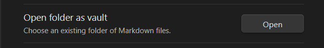
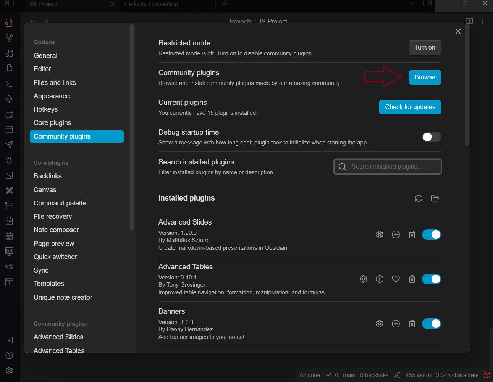
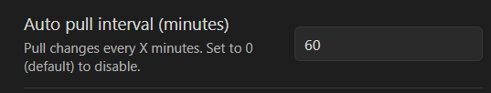

# PD Lecture Notes

## To Get The latest updates for lecture notes

1. Install Git on local machine

- [Git](https://git-scm.com/downloads)
- First time setup :

  ```bash
      git config --global user.name "Your Name"
      git config --global user.email "email@email.com"
    ```

2. Clone the repository to local machine

```bash
   git clone https://github.com/Muhammad-Ashraf9/PD.git
```

3. Pull the latest changes every time before viewing the files

```bash
   git pull
```

### Files are in .md format (Obsidian)

4.  Best way to view the files is to use [obsidian](https://obsidian.md/)

5.  Open the folder in obsidian as vault



6.  Open the file you want to view in obsidian

- you can search in all files
- use `ctrl+p` to search for commands

### To Get latest updates for lectures notes Automatically

7.  Install obsidian git plugin From Community plugins

- settings -> community plugins -> turn off Restricted mode -> browse community plugins -> search for git -> install obsidian-git plugin -> enable plugin


- set obsidian-git plugin settings (auto pull x minutes)




---

## To Contribute

1.  Create a new branch

```bash
   git checkout -b <branch-name>
```

2. Make changes to the files
3. Add the changes to staging area

```bash
   git add .
```

4. Commit the changes

```bash
   git commit -m "commit message"
```

5. Push the changes to remote repository

```bash
   git push origin <branch-name>
```

6. Create a pull request from github website

---
### Contributors

<a href="https://github.com/Muhammad-Ashraf9/PD/graphs/contributors">
  
</a>

